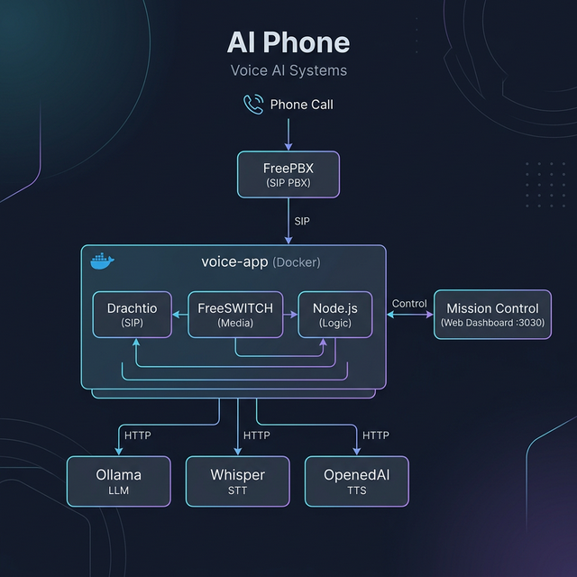

<p align="center">
  
</p>

# AI Phone

Voice interface via SIP — call your local AI, and your AI can call you. **100% private. No cloud APIs required.**

## What is this?

AI Phone gives your local AI a phone number through FreePBX:

- **Inbound**: Call an extension and talk to your local AI
- **Outbound**: Your server calls YOU with alerts, then has a conversation
- **Streaming AI**: Responses stream sentence-by-sentence for natural pacing with thinking phrases and hold music
- **Call Recordings**: Every call is automatically recorded and available in Mission Control
- **Mission Control**: Web dashboard at `http://<your-server-ip>:3030` to monitor status, play recordings, and initiate calls

## How it works



## Prerequisites

| Component | Software |
|-----------|----------|
| PBX | [FreePBX](https://www.freepbx.org/) or any SIP provider |
| LLM | [Ollama](https://ollama.com/) with a chat model (default: `deepseek-r1:8b`) |
| STT | Local Whisper server (e.g. [faster-whisper](https://github.com/SYSTRAN/faster-whisper) or [whisper.cpp](https://github.com/ggerganov/whisper.cpp)) |
| TTS | [Kokoro TTS](https://github.com/remsky/Kokoro-FastAPI) via Kokoro-FastAPI (included in Docker Compose) — runs on CPU, no GPU needed |
| Runtime | Docker + Node.js 18+ |

> **No API keys needed.** No data ever leaves your machine.

## Quick Start

```bash
# 1. Install
curl -sSL https://raw.githubusercontent.com/jayis1/Project-Ph/main/install.sh | bash

# 2. Configure (select which Docker containers run on this machine)
ai-phone setup

# 3. Run
ai-phone start              # Start all configured services
# or
ai-phone start freeswitch   # Start specific services only

# 4. Open Mission Control
# Navigate to http://<your-server-ip>:3030
```

## Setup Wizard prompts

| Prompt | Example |
|--------|---------|
| SIP Domain | `172.16.1.163` |
| SIP Registrar | `172.16.1.163` |
| Extension | `9001` |
| SIP Password | `mysecret` |
| External IP | `172.16.1.163` |
| Ollama API URL | `http://host.docker.internal:11434` |
| Ollama Model | `deepseek-r1:8b` |
| Local Whisper URL | `http://host.docker.internal:8080/v1` |
| Local TTS URL | `http://host.docker.internal:5002/api/tts` |
| Bot Name | `Trinity` |
| System Prompt | `You are Trinity...` |

## CLI Commands

```bash
ai-phone setup              # Interactive configuration wizard
ai-phone start              # Launch all configured Docker containers
ai-phone start <services>   # Launch specific containers (e.g. freeswitch voice-app)
ai-phone stop               # Stop services
ai-phone stop <services>    # Stop specific containers
ai-phone status             # Check container and SIP status
ai-phone doctor             # Run health checks
ai-phone logs               # Tail logs
```

## Advanced: Distributed Multi-Node Architecture

```text
┌─────────────────────────┐           ┌────────────────────────────┐
│ Machine 3 (LXC AI)      │           │ Machine 4 (LXC Voice)      │
│ ⟷ Drachtio (:5070)      │ ⟷ (SIP) ⟷ │ Voice App (:3000)          │
│                         │           │  ↑ FreeSWITCH              │
│    Whisper (:8080) ⟵────┼───(HTTP)──┤  │ Audio IN                │
│    Kokoro  (:8880) ⟵────┼───(HTTP)──┤  ↓ Audio OUT               │
└─────────────────────────┘           └──────────────┬─────────────┘
                                                     │
                                                 (HTTP API)
                                                     │
                                                     ▼
                                          ┌─────────────────────────┐
                                          │ Machine 2 (Ollama)      │
                                          │ ⟷ gemma3:12b            │
                                          └─────────────────────────┘
```

The AI Phone is designed as a suite of decoupled microservices. You can run all 5 containers on one machine, or split them across a Proxmox cluster to isolate the heavy GPU/AI processing from your PBX SIP routing.

During `ai-phone setup`, you will see an **Infrastructure Deployment** prompt. Use the `Spacebar` to Check/Uncheck the exact containers you want running on that specific Linux instance.

**Example 4-Machine Split:**
1. **Machine 1 (Asterisk/FreePBX)**: Doesn't run docker, just your PBX.
2. **Machine 2 (GPU Server)**: Pure Ollama server.
3. **Machine 3 (The Brain)**: Run `ai-phone setup` and only check `SIP Signaling (Drachtio)`, `Speech-to-Text`, and `Text-to-Speech`.
4. **Machine 4 (Voice Engine)**: Run `ai-phone setup` and only check `Media Engine (FreeSWITCH)` and `Voice App`.

## Mission Control

A web dashboard is served at **port 3030** when the voice-app is running. It provides:

- **System Status** — live view of Drachtio (SIP) and FreeSWITCH (media) connectivity
- **Device List** — all registered extensions and their voice configs
- **Outbound Calls** — initiate outbound calls to any phone number from the browser
- **Call Recordings** — playback and download recorded conversations
- **Call History** — track completed, failed, and active calls in real-time
- **Live Logs** — scrolling log view of all voice-app activity

### Initiating an Outbound Call

1. Open Mission Control at `http://<your-server-ip>:3030`
2. Enter the target phone number (e.g. `+4531426562`)
3. Select a device/extension from the dropdown
4. Enter the AI context message (what Trinity should say)
5. Click **Initiate Call**

The AI will call the target number, speak the context message, then enter conversation mode.

### Outbound Call API

```bash
curl -X POST http://localhost:3000/api/outbound-call \
  -H "Content-Type: application/json" \
  -d '{
    "to": "+4531426562",
    "message": "Hey, your server CPU is at 95%. Want me to investigate?",
    "device": "Trinity",
    "mode": "conversation"
  }'
```

## Recommended AI Models

| Model | Size | RAM | Best for |
|-------|------|-----|----------|
| `deepseek-r1:8b` | 4.9GB | ~6GB | **Default** — fast with chain-of-thought reasoning |
| `llama3.1:8b` | 4.7GB | ~6GB | Fast responses, basic conversation |
| `qwen2.5:14b` | 9GB | ~12GB | Smart + fast enough for calls |
| `gemma2:27b` | 16GB | ~20GB | Smartest, but slower (5-10s response time) |

```bash
# Switch models
ollama pull deepseek-r1:8b
# Update OLLAMA_MODEL in your .env, then:
docker rm -f voice-app; docker compose up -d --build voice-app
```

## Local AI Setup Tips

### Ollama
```bash
ollama pull qwen2.5:14b
ollama serve   # Already runs on :11434 by default
```

### Whisper (STT)
```bash
# faster-whisper server
docker run -p 8080:8000 fedirz/faster-whisper-server
```
The voice app will POST audio to `/v1/audio/transcriptions` (OpenAI-compatible format).

### Kokoro TTS (via Kokoro-FastAPI)
Included in Docker Compose — starts automatically with `ai-phone start`.

The `kokoro-tts` container runs Kokoro-82M TTS and exposes an OpenAI-compatible `/v1/audio/speech` endpoint on port 8880. Runs fast on CPU (3-5x real-time speed).

```bash
# Test TTS independently
curl http://localhost:8880/v1/audio/speech \
  -X POST -H 'Content-Type: application/json' \
  -d '{"input":"Hello world","model":"kokoro","voice":"af_heart","response_format":"wav"}' \
  --output test.wav
```

## Network & Port Configuration

| Port | Service | Notes |
|------|---------|-------|
| 3000 | Voice App HTTP | Audio files, outbound API |
| 3030 | Mission Control | Web dashboard |
| 5060 | FreePBX/Asterisk | SIP signaling (PBX) |
| 5070 | Drachtio | SIP signaling (voice-app) |
| 30000-30100 | FreeSWITCH | RTP media (audio) |

> **Important:** Drachtio uses port **5070** to avoid conflict with FreePBX on 5060. All containers run in `host` networking mode.

## Environment Variables

See [`.env.example`](.env.example) for all configurable variables. Key ones:

| Variable | Purpose |
|----------|---------|
| `EXTERNAL_IP` | Server LAN IP for RTP routing |
| `OLLAMA_API_URL` | URL to Ollama instance |
| `OLLAMA_MODEL` | Chat model to use (default: `deepseek-r1:8b`) |
| `LOCAL_TTS_URL` | Kokoro TTS API endpoint (default: port 8880) |
| `LOCAL_STT_URL` | Whisper STT API endpoint |
| `SIP_DOMAIN` | FreePBX server FQDN or IP |
| `SIP_REGISTRAR` | SIP registrar address |
| `DRACHTIO_SIP_PORT` | Drachtio SIP port (default: `5070`) |

## FreePBX Trunk Configuration

For outbound PSTN calls, your SIP trunk needs `from_user` set to your trunk account ID. If FreePBX regenerates the config and removes it:

```bash
sed -i '/^\[YourTrunk\]$/a from_user=YOUR_ACCOUNT_ID\nfrom_domain=YOUR_PROVIDER_DOMAIN' /etc/asterisk/pjsip.endpoint.conf
asterisk -rx "module reload res_pjsip.so"
```

Also ensure the outbound route has a dial pattern of `.` (matches all numbers) with your trunk selected.

## Documentation

- [cli/README.md](cli/README.md) - CLI reference
- [docs/TROUBLESHOOTING.md](docs/TROUBLESHOOTING.md) - Common issues
- [voice-app/DEPLOYMENT.md](voice-app/DEPLOYMENT.md) - Production deployment
- [voice-app/README-OUTBOUND.md](voice-app/README-OUTBOUND.md) - Outbound call API
